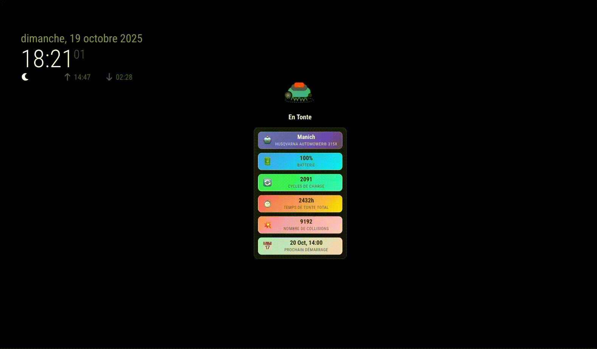

# MMM-Husqvarna-Status

MagicMirror² module to display the status of your Husqvarna Automower with visual animations.

[](screenshots/example.gif)

[Voir la version française / See French version](README.fr.md)

---

## 🚀 Features

- Animated mower visualization (different animations depending on mower state)
- Battery, next start, total cutting time and other statistics
- Multilingual (English and French)
- Automatic polling of the Husqvarna Automower API

See example on [STATUS_EXAMPLE.md](STATUS_EXAMPLE.md)

## Requirements

1. Husqvarna Developer account and an application registered on the Husqvarna Developer Portal [see here](https://developer.husqvarnagroup.cloud/)
2. Client ID and Client Secret from Husqvarna
3. MagicMirror²

## Installation

1. Go to your MagicMirror modules folder :

```bash
cd ~/MagicMirror/modules
```

2. Clone this repository:

```bash
git clone https://github.com/jboucly/MMM-Husqvarna-status.git
```

3. Install dependencies:

```bash
npm install
```

## Configuration

Add the module to your `config/config.js`:

You can copy and paste the file : [config-example.js](config-example.js)

```javascript
{
    module: "MMM-Husqvarna-Status",
    position: "middle_center",
    config: {
        // REQUIRED CONFIGURATION
        clientId: "your-client-id-here",
        clientSecret: "your-client-secret-here",

        // OPTIONAL CONFIGURATION
        updateInterval: 60000,
        showDetails: true,
        animationSpeed: 2000,

        showName: true,
        showCycles: true,
        showBattery: true,
        showCuttingTime: true,
        showCollisions: true,
        showNextStart: true
    }
}
```

### Options

| Options         | Required | Type      | Default | Description                                                                                          |
| --------------- | -------- | --------- | ------- | ---------------------------------------------------------------------------------------------------- |
| clientId        | ✅       | `string`  | null    | Client id from your Husvarna application. Obtain it from https://developer.husqvarnagroup.cloud/     |
| clientSecret    | ✅       | `string`  | null    | Client secret from your Husvarna application. Obtain it from https://developer.husqvarnagroup.cloud/ |
| updateInterval  | ❌       | `number`  | 60000   | Interval to update status. Default is `60000ms` = 1 min                                              |
| animationSpeed  | ❌       | `number`  | 2000    | Speed of animation of mower. Default is `2000ms`                                                     |
| showDetails     | ❌       | `boolean` | true    | Display table detail of mower                                                                        |
| showName        | ❌       | `boolean` | true    | Display name of your mower                                                                           |
| showCycles      | ❌       | `boolean` | true    | Display the number of charge cycles of your mower battery                                            |
| showBattery     | ❌       | `boolean` | true    | Display percentage of battery                                                                        |
| showCuttingTime | ❌       | `boolean` | true    | Display the number of cutting time                                                                   |
| showCollisions  | ❌       | `boolean` | true    | Display the number of collision                                                                      |
| showNextStart   | ❌       | `boolean` | true    | Display the date or time your mower will next start                                                  |

## Usage

Restart MagicMirror after configuration. The module authenticates with Husqvarna and displays mower data. Run MagicMirror in dev mode to see logs for debugging.

## Mower states and animations

- MOWING : lateral movement + grass blades animation
- CHARGING : glow + lightning icon animation
- PARKED : breathing sleep animation + Z icons
- GOING_HOME : mower moving to the charging station + home icon
- LEAVING : mower leaving the charging station
- ERROR : Mower surrounded by a red square

## Troubleshooting

- Authentication issues: check your Client ID/Client Secret and account
- No mower found: ensure mower is linked to your Husqvarna Connect account
- Network issues: check your internet connection and Husqvarna API availability
- Logs: run MagicMirror in dev mode and inspect console logs

```bash
npm start:dev
```

## API

This module uses `husqvarna-authentication-sdk` for authentication and `automower-connect-sdk` to fetch mower data.

- [automower-connect-sdk](https://www.npmjs.com/package/automower-connect-sdk)
- [husqvarna-authentication-sdk](https://www.npmjs.com/package/husqvarna-authentication-sdk)

You can see the source code for more details [here](https://github.com/jboucly/husqvarna-sdk-generator).

## Contributing

Contributions are welcome — open issues and pull requests on GitHub.

## License

MIT
