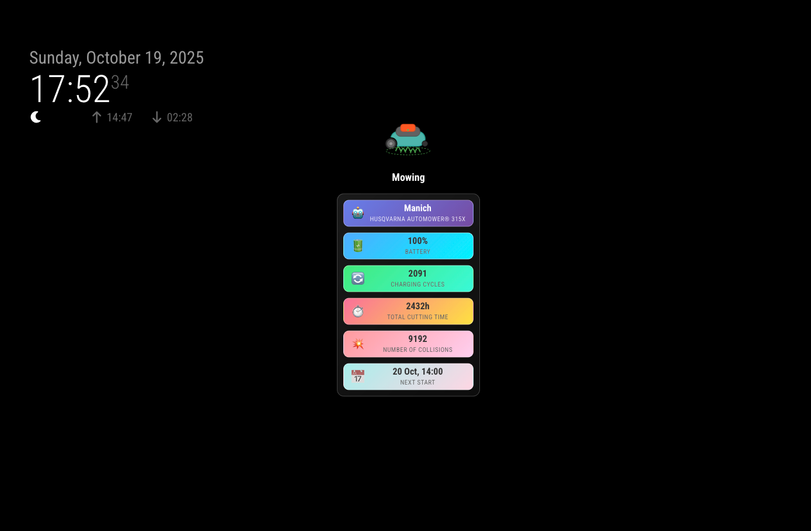
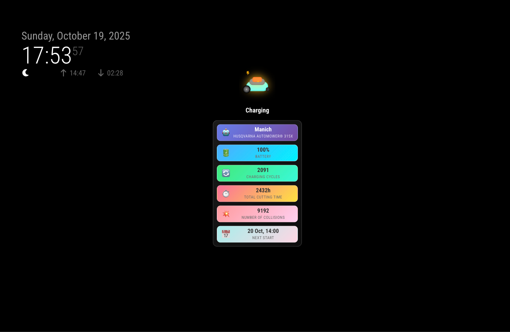
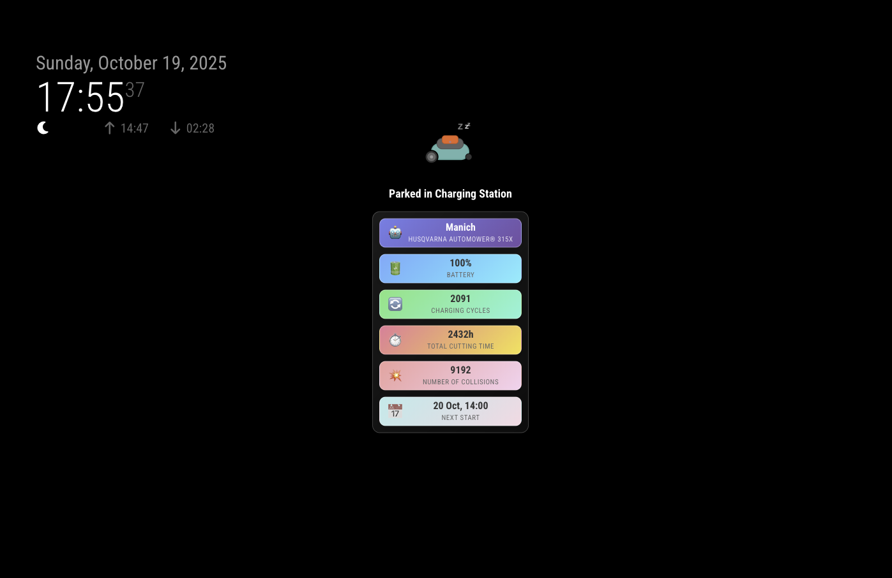
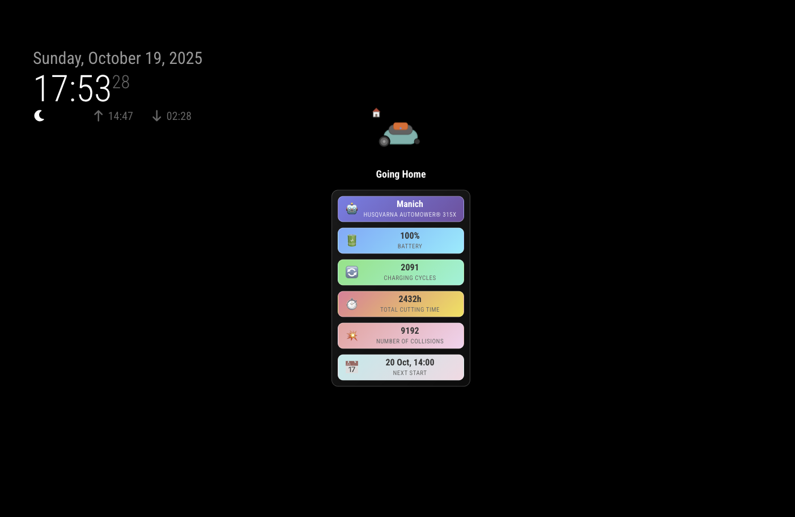
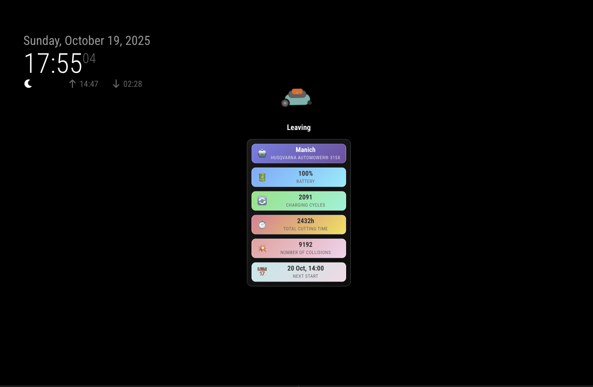
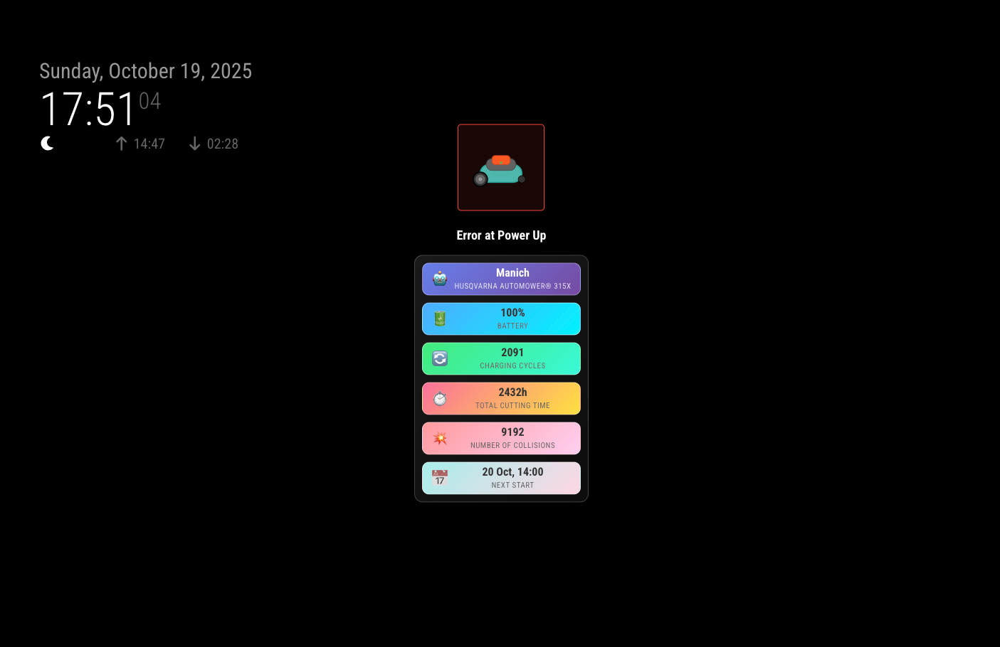

# MMM-Husqvarna-Status Example Status Output

This file shows example screenshots of the different status that can be displayed by the MMM-Husqvarna-Status module for MagicMirror².

## Mowing State

## Charging State

## Parked State

## Going Home State

## Leaving State

## Error State

